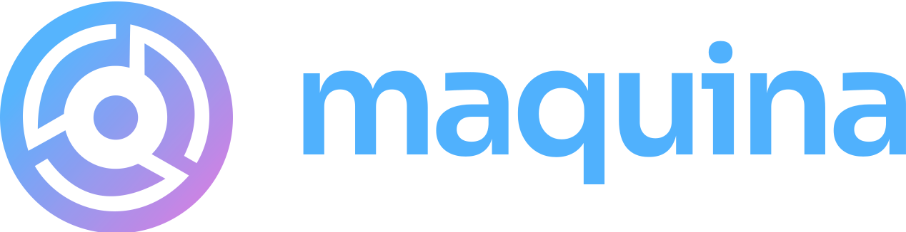

  

  <strong>Open-source tools for Rails developers who'd rather build products than boilerplate.</strong>
   
  <a href="https://maquina.app">maquina.app</a>

---

We believe in the power of Rails as a Single Man Framework—where one developer can ship real products without drowning in configuration, build pipelines, or infrastructure complexity. Our tools embrace the NoBuild philosophy and recognize that most successful software is, at its core, well-crafted CRUD.

## Philosophy

- **NoBuild** — Skip the bundlers, transpilers, and build steps. Ship HTML, CSS, and JavaScript that browsers already understand.
- **Single Man Framework** — Rails gives one person the leverage to build what used to require a team. Our tools amplify that.
- **CRUD is not a dirty word** — Most valuable software creates, reads, updates, and deletes data. We optimize for that reality instead of pretending otherwise.

## Projects

### UI & Frontend

**[maquina_components](https://github.com/maquina-app/maquina_components)**
Modern UI components for Ruby on Rails, powered by TailwindCSS and Stimulus. Inspired by shadcn/ui, built for Rails developers who want polished interfaces without leaving the Rails ecosystem.

### Developer Tools

**[rails-mcp-server](https://github.com/maquina-app/rails-mcp-server)**
A Model Context Protocol server that lets LLMs understand and interact with your Rails projects. Connect Claude or other AI assistants directly to your codebase for intelligent assistance.

**[nvim-mcp-server](https://github.com/maquina-app/nvim-mcp-server)**
MCP server implementation for Neovim. Bridge your editor to AI-powered workflows.

**[rails-upgrade-skill](https://github.com/maquina-app/rails-upgrade-skill)**
A Claude Skill that helps you upgrade Rails applications. Automates the analysis and provides step-by-step migration guidance.

**[git-continuity](https://github.com/maquina-app/git-continuity)**
Seamlessly transfer work-in-progress between machines without polluting your git history. Perfect for moving between your desktop and laptop mid-feature.

### macOS Utilities

**[redis-menu](https://github.com/maquina-app/redis-menu)**
A menu bar app for managing local Redis instances. Start, stop, and monitor Redis without touching the terminal.

**[mongo-menu](https://github.com/maquina-app/mongo-menu)**
A menu bar app for managing local MongoDB instances. Simple database management from your menu bar.

## Get Involved

All our projects are MIT licensed. Contributions, issues, and discussions are welcome.

---

*Built for Rails developers, by Rails developers.*

---

2025 © Mario Alberto Chávez Cárdenas
